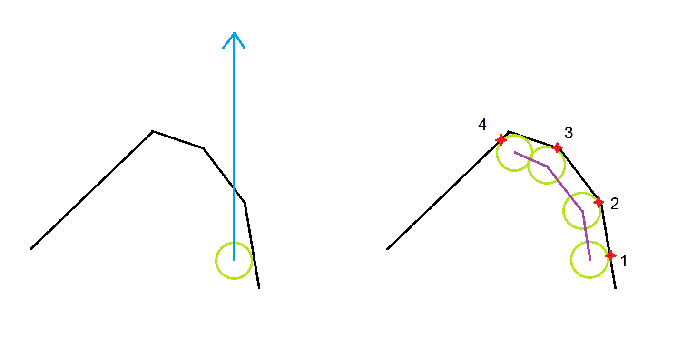

# Character Concepts

## Grounding

In this character controller, a character is considered grounded (`KinematicCharacterBody.IsGrounded`) if its `KinematicCharacterBody.GroundHit` satisfies the requirements of your implementation of `IsGroundedOnHit` in your ``. A `GroundHit` can exist even if `IsGrounded` is false. For example, if the character is on a very steep slope and sliding down, `GroundHit` will be the slope hit, but `IsGrounded` will be false. The default `IsGroundedOnHit` implementation is based on slope angle and the character's velocity relatively to the ground entity's velocity (to prevent the character from being grounded if its velocity is escaping the ground entity's velocity when the character is already in air).

`GroundHit` can be detected at different points of the character update:
* during `KinematicCharacterAspect.Update_Grounding`
* during `KinematicCharacterAspect.Update_MovementAndDecollisions`

Grounding can have various effects on character movement, depending on the various options in `KinematicCharacterProperties`:
* if `KinematicCharacterProperties.SnapToGround` is true, the character will constantly adjust its position to "snap" right back to the ground whenever there is any distance between it and the ground hit
* The standard character grounded velocity control handles velocity differently based on whether the character is grounded or not. Moreover, `CharacterControlUtilities.StandardGroundMove_Interpolated` will always reorient the target velocity on the ground plane by default.  
* When the character needs to decollide itself from a hit where it is considered grouded, it will decollide only in the direction of its `KinematicCharacterBody.GroundingUp`. This helps with standing on moving platforms that can rotate around all axis, without having the character drift to the sides.
* etc...

## Movement & Collision detection

The character movement algirithm uses continuous collision detection to sweep the character's collider in the movement direction, detect hits, advance character position to the detected hit, project the character velocity on the hit normal, and then keep repeating these steps until all of the movement for this frame has been consumed, or until the maximum number of `KinematicCharacterProperties.MaxContinuousCollisionsIterations` has been reached:

In this image, we have a top-down view of what happens when a character (green) wants to move by a given movement vector (blue) in a single frame. The character will start by casting its collider using the blue movement vector, and it will detect hit #1. It will then project its velocity vector against the hit, which will result in a new velocity represented by the first purple line. The character will then keep casting its collider again and repeat this process to detect hits #2, #3, and #4 and project its velocity again each time. Once it has reached hit #4 however, the internal character movement algorithm will detect that the character has reached a "blocking corner" and will instantly set velocity to zero, which will put an end to the movement iterations. All of this happens in a single frame.

After the character movement iterations are over, the character will detect any colliders it is currently overlapping with, and then it will decollide from them.

## Parent

You are not allowed to make the character entity be a child of another entity by using the regular parenting mechanic of the Transforms system. However, you can do it by setting the `KinematicCharacterBody.ParentEntity`.

Internally, the default moving platforms detection update (`KinematicCharacterAspect.Update_MovingPlatformDetection`) automatically updates this `ParentEntity` based on whether or not the ground hit is a valid rigidbody with a `TrackedTransform` component. It does so by calling `KinematicCharacterAspect.SetOrUpdateParentBody` with the ground hit entity as parameter on every character update.

