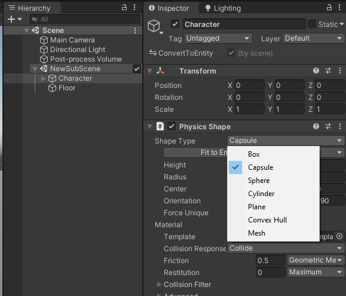

# Change Collision Shape & Dimensions

## Changing shape type at authoring time

Changing the character physics shape is as simple as changing the "Shape Type" in the `PhysicsShape` component of the character GameObject. The only limitation is that it must be a convex shape (all primitives are convex). You can try changing the shape to a "Cylinder" here for example, and this new shape will be taken into account.
 



## Changing the shape dimensions at runtime

If you wish to change the character collider's dimensions at runtime, you would simply do something like this:

```cs
CapsuleCollider* capsuleCollider = (CapsuleCollider*)PhysicsCollider.ColliderPtr; // cast to the type of collider you have now (could be CylinderCollider, BoxCollider, etc...)
capsuleCollider->Geometry.Radius = 1f; // edit the Geometry of the collider
```

Note that you'll need to make sure that the function in which you do this has the `unsafe` declaration. You must also not forget to write back to the `PhysicsCollider` component in the character update job.