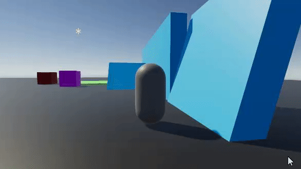
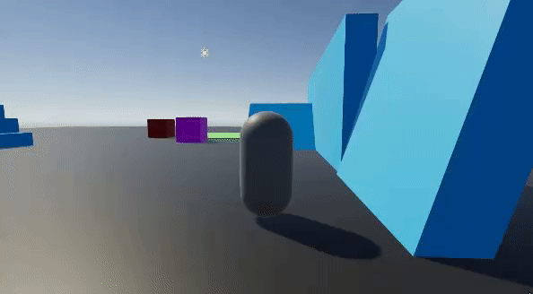

# Constraining Movement to the Ground Plane

The standard characters come with a `ConstrainVelocityToGroundPlane` option under the `Step And Slope Handling` section of the inspector, which is true by default. 

When true, this option makes your character unable to "bump up into the air" when moving fast into slopes that are too steep. 

If false, though, your character will not try to constrain its velocity to the ground, and will bump up in the air

