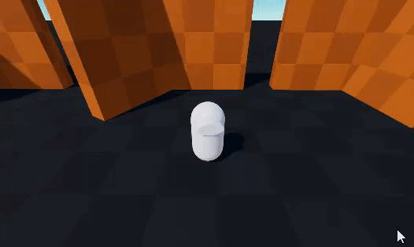

# Prevent Sliding Along Walls Within a Certain Angle Threshold

When your character is moving against a wall at a very perpenticular angle, you may want to prevent it from sliding sideways. Or you may want to simulate a friction with the wall to slow down the character velocity. This can best be accomplished through the `ProjectVelocityOnHits` callback of your character aspect.

The idea is to let the default projection happen in order to obtain the regular solved sliding velocity, but if we detect that we were moving against a wall at a very perpenticular angle, we project the velocity to keep only the vertical part of it :
```cs
public void ProjectVelocityOnHits(
    ref ThirdPersonCharacterUpdateContext context,
    ref KinematicCharacterUpdateContext baseContext,
    ref float3 velocity,
    ref bool characterIsGrounded,
    ref BasicHit characterGroundHit,
    in DynamicBuffer<KinematicVelocityProjectionHit> velocityProjectionHits,
    float3 originalVelocityDirection)
{
    ThirdPersonCharacterComponent characterComponent = CharacterComponent.ValueRO;
    KinematicCharacterBody characterBody = CharacterAspect.CharacterBody.ValueRO;
    
    // Remember velocity before it was projected
    float3 velocityBeforeProjection = velocity;
    
    CharacterAspect.Default_ProjectVelocityOnHits(
        ref velocity,
        ref characterIsGrounded,
        ref characterGroundHit,
        in velocityProjectionHits,
        originalVelocityDirection,
        characterComponent.StepAndSlopeHandling.ConstrainVelocityToGroundPlane);

    // if the latest hit was not-grounded and was within a certain angle threshold with our original velocity (that threshold is calculated with the dot product)...
    KinematicVelocityProjectionHit latestHit = velocityProjectionHits[velocityProjectionHits.Length - 1];
    if (!latestHit.IsGroundedOnHit && math.dot(latestHit.Normal, math.normalizesafe(velocityBeforeProjection)) < -0.85f)
    {
        // ...project the final velocity onto the up vector, to keep only the vertical part of it
        velocity = math.projectsafe(velocity, characterBody.GroundingUp);
    }
}
```

Note: velocity projection works with a collection of all hits so far in the frame in order to better deal with creases and corners. But the last hit in the `velocityProjectionHits` buffer represents the most recent hit.

Without this feature:



With this feature:


_________________________________

If you don't want to completely stop the velocity horizontally, but instead simulate a certain friction/slowdown when the character moves against a wall, you could do something like this instead: 
```cs
public void ProjectVelocityOnHits(
    ref ThirdPersonCharacterUpdateContext context,
    ref KinematicCharacterUpdateContext baseContext,
    ref float3 velocity,
    ref bool characterIsGrounded,
    ref BasicHit characterGroundHit,
    in DynamicBuffer<KinematicVelocityProjectionHit> velocityProjectionHits,
    float3 originalVelocityDirection)
{
    ThirdPersonCharacterComponent characterComponent = CharacterComponent.ValueRO;
    
    CharacterAspect.Default_ProjectVelocityOnHits(
        ref velocity,
        ref characterIsGrounded,
        ref characterGroundHit,
        in velocityProjectionHits,
        originalVelocityDirection,
        characterComponent.StepAndSlopeHandling.ConstrainVelocityToGroundPlane);

    // if the latest hit was not-grounded...
    KinematicVelocityProjectionHit latestHit = velocityProjectionHits[velocityProjectionHits.Length - 1];
    if (!latestHit.IsGroundedOnHit)
    {
        // Reduce the final solved velocity
        velocity *= 1f - frictionRatio;
    }
}
```