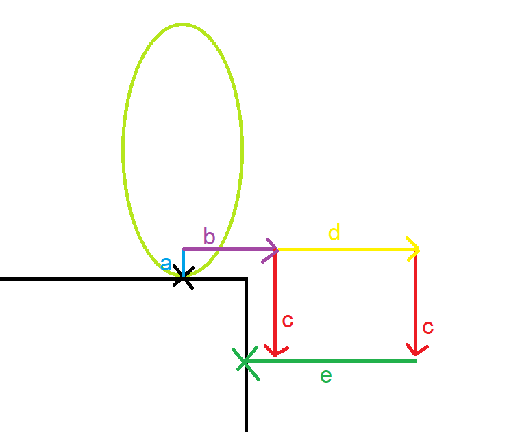

# Prevent Grounding Based on Slope Angle Changes

See [Tutorial - Step Handling and Slope Changes](../Tutorial/tutorial-steps-and-slopes.md)

There are times when you might want your character to not consider itself grounded when it is moving off of a ledge towards no valid grounding, or not be grounded when going over a certain downward change in slope angle. This is so that your character can "launch" off the ledge/slope instead of sticking to it and making the movement feel unnatural. 

The standard characters come with a `BasicStepAndSlopeHandlingParameters` that includes several parameters for this:
* `PreventGroundingWhenMovingTowardsNoGrounding`: prevents sticking to the ground when moving off of a ledge towards no valid grounding
* `HasMaxDownwardSlopeChangeAngle`: prevent sticking to the ground when moving over a downward slope change
* `MaxDownwardSlopeChangeAngle`: max angle in degrees where we can stick to the ground when moving over a downward slope change

These fields are mainly used in your character aspect's `Update_PreventGroundingFromFutureSlopeChange` call. It handles detecting how the slope angle will change ahead of the character, and whether or not the character is heading towards the "no valid grounding" side of a ledge. Here's a depiction of what it does:

* a: height of the initial forward raycast, determined by the `verticalOffset` parameter of the method
* b: a forward raycast of length equal to the `deltaTimeIntoFuture` parameter of the method multiplied by the length of our character velocity
* c: downward raycasts of length equal to the `downDetectionDepth` parameter of the method added to the `verticalOffset`
* d: distance that the second downward raycast will be from the first, equal to the `secondaryNoGroundingCheckDistance` parameter of the method
* e: a backward raycast of length equal to "b" + "d". This ray goes all the way back to the starting point horizontally

The "b" raycast will attempt to detect any obstruction forward. If it hits something, we calculate the positive (upward) `futureSlopeChangeAnglesRadians` between our grounding and the hit slope. If not, we go ahead with the first "c" raycast. If this raycast hits something, we calculate the negative (downward) `futureSlopeChangeAnglesRadians` between our grounding and the slope. If we were not grounded on that hit, or if we didn't hit anything, we determine that we are moving towards no grounding and we set the `isMovingTowardsNoGrounding` out parameter to true. If `isMovingTowardsNoGrounding` is true at this point, we do a second "c" raycast further ahead, to make sure our first "c" raycast didn't just happen to go through a small crack in the ground. If the second "c" raycast finds a grounded hit, we reset `isMovingTowardsNoGrounding` to false, because we did find grounding afterall. Finally, we do a backwards "e" raycast that will do a final attempt at detecting the slope angles.